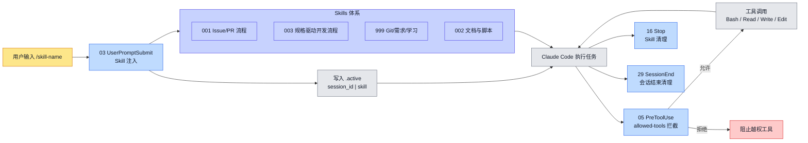
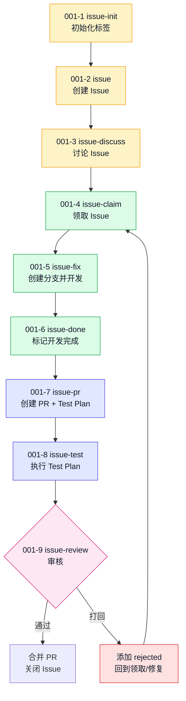

# claude-hk Hooks + Skills 学习笔记

> 来源：对 `xiaoheiDTF/claude-hk` 项目的本地分析与讨论整理  
> 同步目录：`.claude/`  
> 日期：2026-06-07

## 1. 这套系统是什么

`claude-hk` 的核心不是单个 Skill，而是一套给 Claude Code 使用的生命周期自动化系统。它由三部分组成：

| 部分 | 作用 | 典型目录 |
|---|---|---|
| Hooks | 接入 Claude Code 生命周期事件，例如会话开始、用户提交 prompt、工具调用前、会话结束 | `.claude/hooks/` |
| Skills | 用户通过 `/skill-name` 主动触发的工作流能力 | `.claude/skills/` |
| Go 后端增强 | 提供 session、issue claim、trace 等后端能力 | `claude_tap_plus/` |

本仓库当前同步的是 `.claude/` 目录，也就是 Hooks + Skills 体系。Go 后端没有一并同步。

## 2. 整体闭环

完整闭环可以理解为：

```text
用户输入 /skill-name
  -> 03-user-prompt-submit 注入 Skill 上下文
  -> 写入 .active，记录当前 session 激活的 Skill
  -> Claude Code 按 Skill 规则执行
  -> 05-pre-tool-use 按 allowed-tools 做工具白名单拦截
  -> 16-stop 执行 Skill 清理
  -> 29-session-end 释放 session/issue 状态
```

如果配套 Go 后端运行，Issue claim、session register、session close 等会更可靠；如果后端不可用，shell 侧大多会静默降级继续工作。

## 3. Mermaid 总览图



## 4. 001、003、999 的边界

这套项目容易被误解成“003 自动处理 Issue/PR”。实际不是。

| 系列 | 负责什么 | 不负责什么 |
|---|---|---|
| `001-*` | GitHub Issue 创建、讨论、领取、开发状态、PR、测试、Review | 不负责定义完整开发方法论 |
| `003-*` | 功能树、BDD、API 契约、TDD、CDD、E2E 等开发质量流程 | 不负责自动 claim Issue、自动创建 PR |
| `999-*` | commit、push、需求规划、学习进化 | 不负责 Issue 状态机 |

更准确的组合方式是：

```text
001 负责任务流转
003 负责开发过程质量
999 负责提交和沉淀
Hooks 负责把这些能力接入 Claude Code 生命周期
```

## 5. Issue/PR 工作流



## 6. 003 系列强在哪里

`003-*` 系列强在“流程文档化、阶段边界清晰、可追溯、测试前置”。

它的链路大致是：

```text
功能点/功能树
  -> BDD 场景
  -> 后端 BDD / 前端 BDD
  -> API 契约
  -> 后端 TDD
  -> UI 状态定义
  -> 前端 CDD
  -> E2E 测试
```

它的强约束主要体现在：

| 强约束 | 说明 |
|---|---|
| 阶段边界 | 每个阶段声明“负责什么、不负责什么”，避免一上来就写代码 |
| 文档产物 | 每一步都要求留下结构化内容 |
| 可追溯 | E2E、TDD、CDD 都要能回溯到 BDD/契约/功能点 |
| 用户确认 | 多个阶段要求主动确认理解和边界，减少 AI 自行脑补 |
| 测试前置 | BDD/TDD/CDD/E2E 分层设计，避免实现后才补测试 |

## 7. 003 和 SDD 的关系

这里的 SDD 更适合理解为 Specification-Driven Development，也就是规格驱动开发。

`003-*` 可以视为一种 SDD 风格的 AI 开发流程规范，但它不是传统意义上的“编码规范”。

| 对比项 | 普通 SDD | 003 系列 |
|---|---|---|
| 核心驱动力 | 规格/设计文档 | 功能树、BDD、契约、TDD、CDD、E2E |
| 约束范围 | 需求、设计、接口、架构 | 从需求分析到 E2E 验收 |
| 流程颗粒度 | 相对粗 | 拆成多个 Skill 阶段 |
| 测试位置 | 可能在实现后 | 明确前置和分层 |
| 适用对象 | 团队工程流程 | AI/Agent 协作开发尤其适合 |

更准确的定位：

```text
SDD 定义要做成什么样；
003 系列定义 AI/团队如何一步步把它做出来，并证明它做对了。
```

因此，它可以作为 SDD 的执行层规范，但不建议简单命名为“编码规范”。更适合叫：

- 规格驱动开发流程规范
- AI 协作开发闭环规范
- SDD + BDD/TDD/CDD/E2E 执行流程

## 8. 优点和缺点

### 优点

| 优点 | 说明 |
|---|---|
| 适合 AI 协作 | 能减少 AI 直接脑补需求、跳步骤写代码的问题 |
| 可追溯 | 代码、测试、契约、需求之间有链路 |
| 质量前置 | 测试和验收不是最后补，而是流程的一部分 |
| 适合多人协作 | 每一步都有产物，便于交接和 Review |

### 缺点

| 缺点 | 说明 |
|---|---|
| 流程偏重 | 小 bug、小改动完整执行成本过高 |
| 依赖纪律 | 团队不维护文档时，容易变成形式主义 |
| 技术栈假设明显 | 后端 TDD 偏 Java/Spring Boot，前端 CDD 偏 Vue 3 + Storybook |
| 与自动 Issue/PR 无直接关系 | 003 是开发质量流程，自动 Issue/PR 是 001 的职责 |

## 9. 适合怎么吸收进自己的技能体系

建议不要原样全部启用，而是分层吸收：

| 使用场景 | 推荐做法 |
|---|---|
| 大功能/新模块 | 使用 003 完整链路 |
| 中等功能 | 使用功能树 + BDD + API 契约 + 核心测试 |
| 小 bug | 只用 001 Issue/PR 或 999 Git，不强制走 003 |
| 前端项目 | 保留 UI 状态定义、CDD、E2E |
| 后端项目 | 保留 BDD、API 契约、TDD |

一个实用版本可以是：

```text
需求不清 -> 003-1 功能树
行为复杂 -> 003-2 BDD
前后端协作 -> 003-4 API 契约
核心业务逻辑 -> 003-5 TDD
页面状态复杂 -> 003-6-1 UI 状态定义
上线前验证 -> 003-7 E2E
```

## 10. 本次同步说明

本仓库已同步：

- `.claude/hooks/`
- `.claude/skills/`
- `.claude/scripts/`
- `.claude/lib/`
- `.claude/settings.json`
- `.claude/init.sh`
- `.claude/dirs.conf`

未同步：

- `claude_tap_plus/` Go 后端
- `doc/` 中大量原项目文档

如果后续要完整使用 Issue 原子领取、session 后端追踪、trace 等增强能力，需要再评估是否同步或重构 `claude_tap_plus/`。
